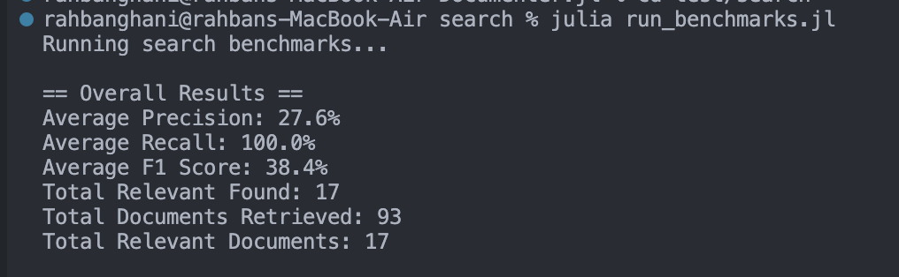
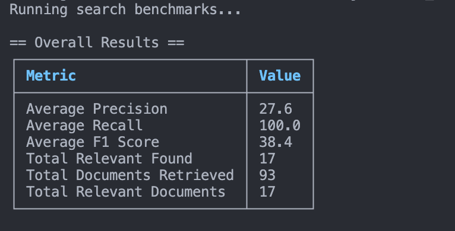

# Adding Search Benchmarks

We had our first meeting, and we discussed what would be the flow of the entire internshiop and also discussed how to go about the first deliverable as per the proposal which is **Adding Search Benchmarks**.  

We discussed what should be the language of choice for writing scripts for benchmarking, we had two possible candidates, one was Julia (for obvious reasons, since the whole repo is in Julia) and the other one was JavaScript since the search functionality is implemented in JavaScript so it would be easier to interact with the search functionality.  

We talked about it and thought of JavaScript as a better choice but now I think of it, I belive the barebone architecture for benchmarks should be in Julia only so that in future if anybody want to add more benchmarks or new tests they can do it easily as I am expecting most of the people coming in the Documenter repo are coming from Julia background and as far as interacting to the JavaScript based search functionality we can see how to do it through Julia in coming days.

## Creating query structure

First we'll create a new directory in test folder, I have named it **search**.
Inside it I have created the first file named **test_queries.jl**

The file structure look like this :

```
test/
├─search/
│   └─test_queries.jl
...
```

I started with creating a basic struct which stores the search query and what should be the expected docs in the following manner :

```
struct TestQuery
    query::String
    expected_docs::Vector{String}
end
```

we can then compare it with the actual result and find out the different benchmarks.

Now we can create different groups of queries like basic queries or queries specific to Julia syntax and if anybody from the community want to test some queries specific to their usecase, they can do it easily. We can then use them all together using something like vcat which will concatenate all the arrays into one
 
## Evaluation 

For now, I am using three metrics for calculating benchmarks namely :

- Precision 
    - measures how many of the returned results are relevant.
    - *Example*: if you returned 5 docs, out of which 3 are relevant, precision = 3/5 = 0.6.
- Recall 
    - measures how many of the true relevant documents were found in the result.
    - *Example*: if there were 4 relevant docs and you returned 3 of them, recall = 3/4 = 0.75.
- F1 Score 
    - harmonic mean of precision and recall.
    - this balances precision and recall in a single number.
    - $F_1 = 2 \times \frac{\text{precision} \times \text{recall}}{\text{precision} + \text{recall}}$


## Helper functions 

Now let's create a function that evaluate all these metrics for a single query

It'll look something like this :
```julia
function evaluate_query(search_function, query::TestQuery)
    results = search_function(query.query)

    precision = calculate_precision(results, query.expected_docs)
    recall = calculate_recall(results, query.expected_docs)
    f1 = calculate_f1(precision, recall)

    return Dict(
        "query" => query.query,
        "precision" => precision,
        "recall" => recall,
        "f1" => f1,
        "expected" => query.expected_docs,
        "actual" => results
    )
end
```

This will return a dictionary that have all the relevant results.
We still have to create the search function that will search the query in our actual search implementation.

This looks good, now we need to create a function that evaluate all metrics for a suite of queries, which would essentially be calling the ```evaluate_query``` function for array of queries, and then calculating the mean of all results for each metric and return a dictionary similar to ```evaluate_query``` function

It look something like this : 
```julia
function evaluate_all(search_function, queries)
    results = [evaluate_query(search_function, q) for q in queries]

    avg_precision = mean([r["precision"] for r in results])
    avg_recall = mean([r["recall"] for r in results])
    avg_f1 = mean([r["f1"] for r in results])

    return Dict(
        "individual_results" => results,
        "average_precision" => avg_precision,
        "average_recall" => avg_recall,
        "average_f1_score" => avg_f1
    )
end
```

## The Meeting #2

We had our weekly meeting and there were few suggested edits which we are going to implement :
 - use struct instead of dictionary to return the search results.
 - just display the overall result in the terminal and rest all of the detailed results should be written in a text file.
 - the returning struct should also contain integers like ```total_documents_retrieved, total_relevant_found``` along with float. 
 - Write short, descriptive comments explain the code
 - my mentors has advised me to open a pr, so that other people can see and give their suggestions on the work done till now how here the open pr link : [PR Link](https://github.com/JuliaDocs/Documenter.jl/pull/2740)


We have now created this struct for a single search query 
```julia
struct QueryResult
    query::String
    precision::Float64
    recall::Float64
    f1::Float64
    expected::Vector{String}
    actual::Vector{String}
    # Raw integer values used in calculations
    relevant_count::Int  # Number of relevant documents found
    total_retrieved::Int  # Total number of documents retrieved
    total_relevant::Int   # Total number of relevant documents
end
```

and one for multiple search queries
```julia
struct EvaluationResults
    individual_results::Vector{QueryResult}
    average_precision::Float64
    average_recall::Float64
    average_f1_score::Float64
    # Raw integer values for overall evaluation
    total_relevant_found::Int    # Total number of relevant documents found across all queries
    total_documents_retrieved::Int  # Total number of documents retrieved across all queries
    total_relevant_documents::Int   # Total number of relevant documents across all queries
end
```

also I have done relevant changes to the previously made functions and now from each function we are returning values with the struct only, much more robust!

## Printing the Benchmarks

we are writing the overall results in the cli and the detailed results are written in a file which would be named : search_benchmark_results_yyyy-mm-dd_HH-MM-SS.txt, where the placeholders will be filled by the date and time when that file was build.

right now we are just displaying it as it is but my maintainer has suggested to use a Julia package named PrettyTables.jl

right now this is how the results in CLI are looking 



we can definitely make it prettier using [PrettyTable.jl](https://ronisbr.github.io/PrettyTables.jl/stable/)

and now after using the PrettyTable.jl package, it is looking like this : 



Looking much better! (IMO Obviously)

## Imitating the Search

Now since we want to search for the query and compare it with the expected result we want to imitate the search functionality originally implemented in the Documenter which uses the minisearch engine

so the steps would look like :
 - Loading the search index
 - Install the minisearch using npm
 - Writing the js code to use the minisearch engine
 - Run the code
 - Return the results as actual docs for comparison with expected docs

Let's start with loading the search index.
Now we have thought of multiple ways of going about this, the main challenge was where should we get the search index from, our options are :
- using the search index built during the test process :

```julia
search_index_path = joinpath(@__DIR__, "../examples/builds/html/search_index.js")
```

- using the actual search index built during the build process of the Documenter documentation

```julia
    search_index_path = joinpath(@__DIR__, "../../docs/build/search_index.js")
```

I have gone with the later, since if we use the search index that is used in production we can do more thorugh testing

so the whole function now look like this : 

```julia
    # Load the real search index from test examples (already built!)
    function load_real_search_index()
        # Use the example search index that's already built and tested
        search_index_path = joinpath(@__DIR__, "../../docs/build/search_index.js")

        if !isfile(search_index_path)
            error("Search index not found at: $search_index_path")
        end

        # Read and parse the JavaScript file
        content = read(search_index_path, String)

        # Find the JSON data after "var documenterSearchIndex = "
        json_start = findfirst("var documenterSearchIndex = ", content)
        if json_start === nothing
            error("Invalid search index format: missing variable declaration")
        end

        # Extract JSON content (everything after the variable declaration)
        json_content = content[(last(json_start) + 1):end]

        # Parse the JSON
        parsed = JSON.parse(json_content)
        return parsed["docs"]  # Return just the docs array
    end
```

if the file doesn't exist we throw an error, else we read the file using the read function available in Julia, now the search index file has structure like this : 

```julia
var documenterSearchIndex = {"docs":[{"location":"linenumbers/#@repl,-@example,-and-@eval-have-correct-LineNumberNodes-inserted","page":"@repl, @example, and @eval have correct LineNumberNodes inserted"...}]
```

so we access the search index by removing the `var documenterSearchIndex = ` part by storing its last index and we store everything after that in `json_content` array, then we parse it using `JSON.parse` and from it return the value of parsed["docs"] to finally get the complete search index in JSON format.

Now we'll install the minisearch using npm
for this we just did created a package.json and added minisearch as a dependency, here a little hiccup came since I initially used `^6.1.0` for the version but my mentors advised to use the exact version which is getting used in the Documenter which is `6.1.0` so I fixed it, here's what the package.json looks like:

```
{
"name": "documenter-search-benchmark",
"version": "1.0.0",
"description": "Search benchmarking for Documenter.jl",
"dependencies": {
    "minisearch": "^6.1.0"
}
}
```

next step, we'll be writing the JS code to use the minisearch engine
Now my initial thought would be that this is a piece of cake, just call the search functionality already implemented in `assets/html/js/search.js` and we are good to go but what I didn't realize is that they both have different execution environments, the original search functionality is designed for the browser, where ours is a Julia script, it runs in a command line environment using Node.js as a subprocess to execute JavaScript. so now we have two options :
 - Replicate the core logic
    - Pros : no new dependence
    - Cons : Violates DRY
- Isolate the pure search logic in another file and then call it in both the places `assets/html/js/search.js` and `test/search/real_search.jl`
    - Pros : Obeys the DRY principle
    - Cons : have to add a new build tool to a primarily Julia project

I did gave a try to the second option but finally I have gone with the first approach as it is more simple and since it is primarily a Julia project I don't want to add unnecessary JS dependencies in it.

so initially I created a string only with all the JS code and named it wrapper_js and just read it, but that end up becoming a very big string so my mentor suggested to have a seperate .js file and read it from there so we are doing that and injecting data using placeholders so now we don't have to spin the full browser to test the search functionality, which would be much slower

## Adding Make Command

My mentor suggested to add a make command that run these tests, I named it `search-benchmarks`

the command is pretty simple : 

```makefile
search-benchmarks:
	${JULIA} --project test/search/run_benchmarks.jl
```

added 

```makefile
rm -f test/search/search_benchmark_results_*.txt
```
to the clean command

and added the search-benchmarks command to the PHONY so it doesn't interpret it as a file rather than a command

```makefile
.PHONY: default docs-instantiate themes help changelog docs test search-benchmarks
```

and finally added this

```makefile
@echo " - make search-benchmarks: run search functionality benchmarks"
```
in the help command to tell the people what does the command do

and now our command works like a charm!

## Running Benchmarks on CI
My mentor asked to add a simple CI job that run these benchmarks, so I created a Github Actions workflow, named it `Benchmarks` (quite creative!) 

so whenever code is pushed to the master repo, or when someone opens a pull request or when it is triggered manually and ensuring only one workflow run at a time using concurrency for the same branch or pull request it does :
 - Checkouts the code 
 - Setup Julia
 - Cache the Julia packages
 - Build Julia packages
 - Run Benchmarks

After I showed it to my mentor he suggested to also upload the full benchmark output as an artifact which can be downloaded by anybody, great idea!

but later he suggested a much better idea, earlier I had a seperate CI job named benchmark.yml so he suggested to not make a seperate job rather put this in the old CI.yml and make it depend on the main suite where the manual is build anyway so we could upload that from the CI run and then download that into this benchmarking job, so we don't have to rebuild the manual for benchmark again

so this is what the final job looks like inside `CI.yml`

```yml
benchmarks:
    name: Julia ${{ matrix.version }} - ${{ matrix.os }} - ${{ matrix.arch }}
    runs-on: ${{ matrix.os }}
    needs: docs
    strategy:
      fail-fast: false
      matrix:
        version:
          - '1'
        os:
          - ubuntu-latest
        arch:
          - x64
    steps:
      - uses: actions/checkout@v4
      - uses: julia-actions/setup-julia@v2
        with:
          version: ${{ matrix.version }}
          arch: ${{ matrix.arch }}
          show-versioninfo: true
      - uses: julia-actions/cache@v2
      - uses: julia-actions/julia-buildpkg@v1
      - name: Download search index
        uses: actions/download-artifact@v4
        with:
          name: search-index
          path: docs/build
      - name: Build test examples
        shell: julia --color=yes --project=test/examples {0}
        run: |
          using Pkg
          Pkg.instantiate()
        env:
          GITHUB_TOKEN: ${{ secrets.GITHUB_TOKEN }}
      - uses: actions/setup-node@v4
        with:
          node-version: '20.x'
      - name: Install Node.js dependencies
        run: npm install
        working-directory: test/search
      - name: Run search benchmarks
        run: make search-benchmarks
        env:
          GITHUB_TOKEN: ${{ secrets.GITHUB_TOKEN }}
      - name: Upload search benchmark results
        uses: actions/upload-artifact@v4
        with:
          name: search-benchmark-results
          path: test/search/search_benchmark_results_*.txt
```

so now in CI the test are running taking the search index from the previous CI and then giving the ability to download the detailed benchmark report. Neat!