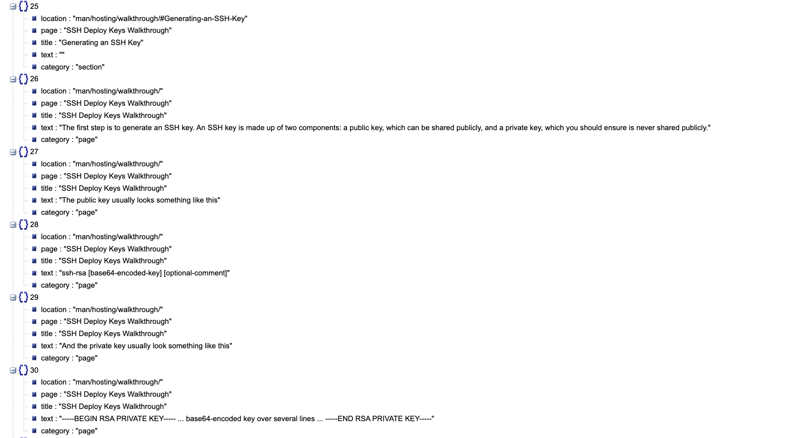
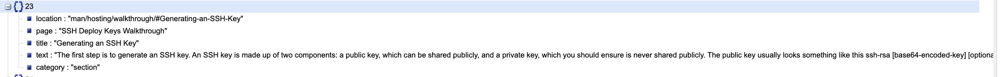
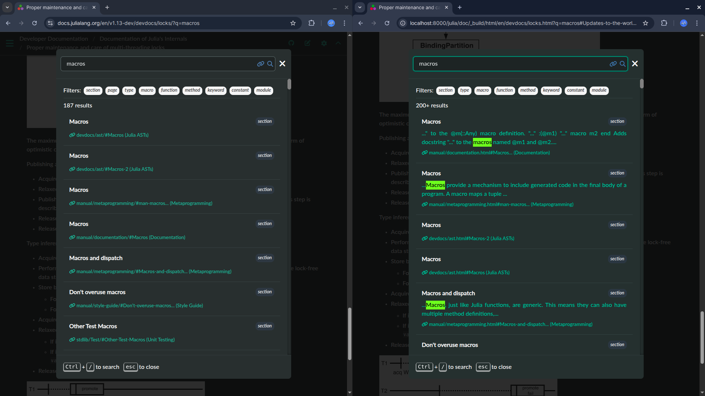
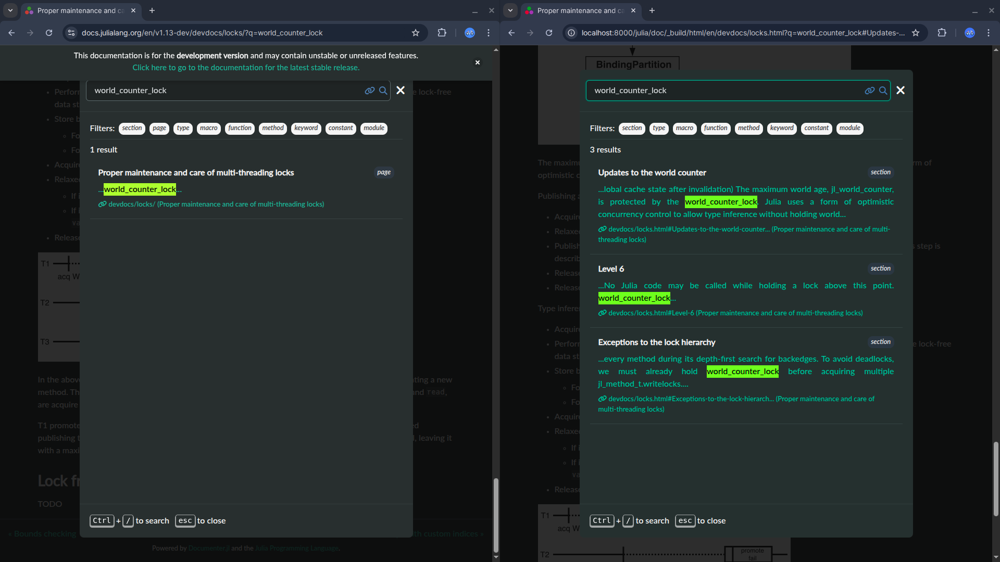
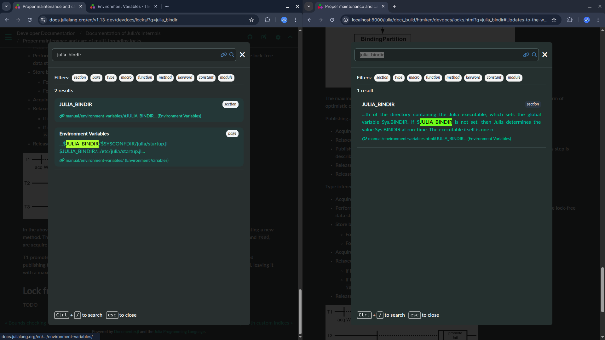
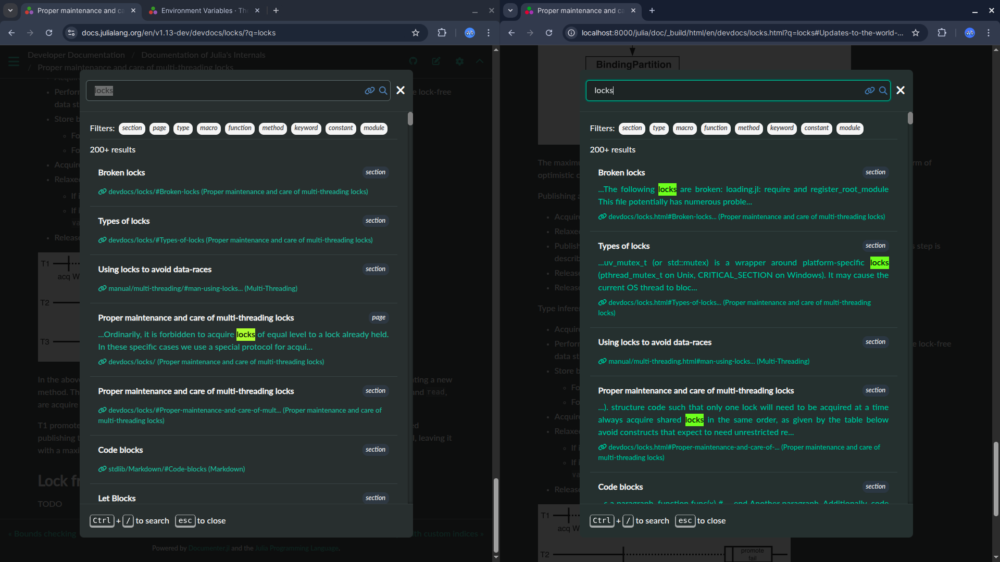

# Remove the page category from the search index and make everything a section

## Relevant PR : [#2762](https://github.com/JuliaDocs/Documenter.jl/pull/2762)

## TL;DR
This PR removes page categories from the search index and concatenates everything into sections instead. The changes modify how
the documentation search functionality organizes content - rather than maintaining separate page categories, all content is
now structured as sections within the search index. This appears to be part of a search index overhaul to simplify the
organization structure.

## Idea
My mentors suggested that the search index size will reduce a lot and the search results will be much better if we could just remove the page category and make everything a section. The biggest blocker in this was what about the text that does not come in any section like the text before any section and the text at the end of the page which does not have any section

## Implementation

### Creating struct
```Julia
# Content segment for grouping content by sections
struct ContentSegment
    section_header::Union{Node, Nothing}  # AnchoredHeader node or nothing for default section
    content_nodes::Vector{Node}           # Content nodes belonging to this section
end
```
### Creating functions
I added two functions to implement this approach 

- First function is `segment_page_by_sections()`
    It breaks page content into segments based on section headers.
```Julia
# Segment page content by sections for improved search indexing
function segment_page_by_sections(page_mdast::Node)
    segments = ContentSegment[]
    current_segment_content = Node[]
    current_section_header = nothing

    for node in page_mdast.children
        if node.element isa Documenter.AnchoredHeader
            # Save previous segment if it has content or a header
            if !isempty(current_segment_content) || current_section_header !== nothing
                push!(segments, ContentSegment(current_section_header, copy(current_segment_content)))
            end
            # Start new section
            current_section_header = node
            current_segment_content = Node[]
        else
            # Skip nodes that shouldn't be indexed
            if !(node.element isa _SEARCHRECORD_IGNORED_BLOCK_TYPES)
                push!(current_segment_content, node)
            end
        end
    end

    # Add final segment
    if !isempty(current_segment_content) || current_section_header !== nothing
        push!(segments, ContentSegment(current_section_header, current_segment_content))
    end

    return segments
end
```

- Second function is `create_segment_search_record()` 
    It creates search record for each content segment
```Julia
# Create search record for a content segment
function create_segment_search_record(ctx::HTMLContext, navnode::Documenter.NavNode, segment::ContentSegment)
    if segment.section_header === nothing
        # Default section - use page title and aggregate content
        page_title = mdflatten_pagetitle(DCtx(ctx, navnode))
        content_text = isempty(segment.content_nodes) ? "" :
            join([mdflatten(node) for node in segment.content_nodes], "\n\n")

        return SearchRecord(
            pretty_url(ctx, get_url(ctx, navnode.page)),
            getpage(ctx, navnode),
            "",  # no fragment for default section
            "section",  # changed from "page" to "section"
            page_title,
            page_title,
            content_text
        )
    else
        # Named section
        a = segment.section_header.element.anchor
        section_title = mdflatten(segment.section_header)
        content_text = isempty(segment.content_nodes) ? "" :
            join([mdflatten(node) for node in segment.content_nodes], "\n\n")

        return SearchRecord(
            pretty_url(ctx, get_url(ctx, navnode.page)),
            getpage(ctx, navnode),
            Documenter.anchor_fragment(a),
            "section",
            section_title,
            mdflatten_pagetitle(DCtx(ctx, navnode)),
            content_text
        )
    end
end
```

and then in the domify function, iteratively create search records for each segment
```Julia
function domify(dctx::DCtx)
    ctx, navnode = dctx.ctx, dctx.navnode
    page_mdast = getpage(ctx, navnode).mdast

    # Generate search index using new segmentation approach
    segments = segment_page_by_sections(page_mdast)
    for segment in segments
        search_record = create_segment_search_record(ctx, navnode, segment)
        push!(ctx.search_index, search_record)
    end

    # Generate HTML as before - process each child node individually
    return map(page_mdast.children) do node
        domify(dctx, node, node.element)
    end
end
```

What we are essentially doing here is concatenating all the content nodes in a single section and joing it with the header to create the `ContentSegment` struct

earlier the search index looked like this 



now it looks like this :



these are some before and after results. Thank you Morten for sharing this :)






